# Computed 执行流程详解

## 概述

`computed` 是 Vue 响应式系统中的计算属性实现，它具有以下特点：

- **懒执行（Lazy Evaluation）**：只有在访问 `.value` 时才会执行计算
- **缓存机制**：通过 `_dirty` 标记实现缓存，避免重复计算
- **双向依赖收集**：
  1. computed 依赖的响应式数据（如 `state.age`）会收集 `computed.effect`
  2. 使用 computed 的外层 effect 会被 `computed.dep` 收集

## 示例代码分析

```javascript
const state = reactive({
  name: 'John',
  age: 18,
});

const doubleAge = computed(() => {
  console.log('state', JSON.stringify(state));
  return state.age * 2;
});

effect(() => {
  console.log('run', state);
  document.getElementById('p1').innerText = `Age: ${doubleAge.value} - p1`;
});

setTimeout(() => {
  state.age = 100; // 触发更新
}, 2000);
```

## ⚠️ 关键概念：两个 Effect 的区别

在这个例子中存在**两个不同的 effect**，这是理解 computed 的关键：

### 1. 外层 effect（用户创建）

```javascript
// 用户手动调用 effect() 创建
effect(() => {
  document.getElementById('p1').innerText = `Age: ${doubleAge.value}`;
});
```

对应源码 `effect.ts#30-33`：

```typescript
export function effect<T = any>(fn: () => T) {
  const _effect = new ReactiveEffect(fn); // 没有 scheduler
  _effect.run(); // 立即执行
}
```

创建的对象：

```javascript
{
  fn: () => { 更新 DOM... },
  scheduler: null,        // ❌ 没有调度器
  computed: undefined     // ❌ 不是 computed
}
```

### 2. computed.effect（computed 内部创建）

```javascript
// computed 内部自动创建
const doubleAge = computed(() => state.age * 2);
```

对应源码 `computed.ts#16-25`：

```typescript
constructor(getter: any) {
  this.effect = new ReactiveEffect(getter, () => {
    // 这是 scheduler 调度器！
    if (!this._dirty) {
      this._dirty = true;
      triggerRefValue(this);
    }
  });
  this.effect.computed = this;  // 标记为 computed
}
```

创建的对象：

```javascript
{
  fn: () => state.age * 2,   // getter 函数
  scheduler: () => {...},    // ✅ 有调度器
  computed: ComputedRefImpl  // ✅ 指向 computed 实例
}
```

### 对比表格

| 特性                | 外层 effect           | computed.effect              |
| ------------------- | --------------------- | ---------------------------- |
| **创建方式**        | 用户手动 `effect(fn)` | `computed()` 内部自动        |
| **fn 函数**         | 更新 DOM              | getter `() => state.age * 2` |
| **scheduler**       | ❌ null               | ✅ 有                        |
| **effect.computed** | ❌ undefined          | ✅ 指向 ComputedRefImpl      |
| **依赖变化时**      | 直接执行 `run()`      | 执行 `scheduler()`           |

### 依赖关系图

```
┌─────────────────────────────────────────────────────────────┐
│                                                             │
│  state.age 的 dep: [computed.effect]                        │
│       │                                                     │
│       │ 当 state.age 变化                                   │
│       ▼                                                     │
│  触发 computed.effect.scheduler()                           │
│       │                                                     │
│       │ scheduler 内部调用 triggerRefValue                  │
│       ▼                                                     │
│  computed.dep: [外层 effect]                                │
│       │                                                     │
│       │ 触发外层 effect                                     │
│       ▼                                                     │
│  外层 effect.run() → 访问 doubleAge.value → 重新计算        │
│                                                             │
└─────────────────────────────────────────────────────────────┘
```

### 数据流与依赖关系图（Mermaid）

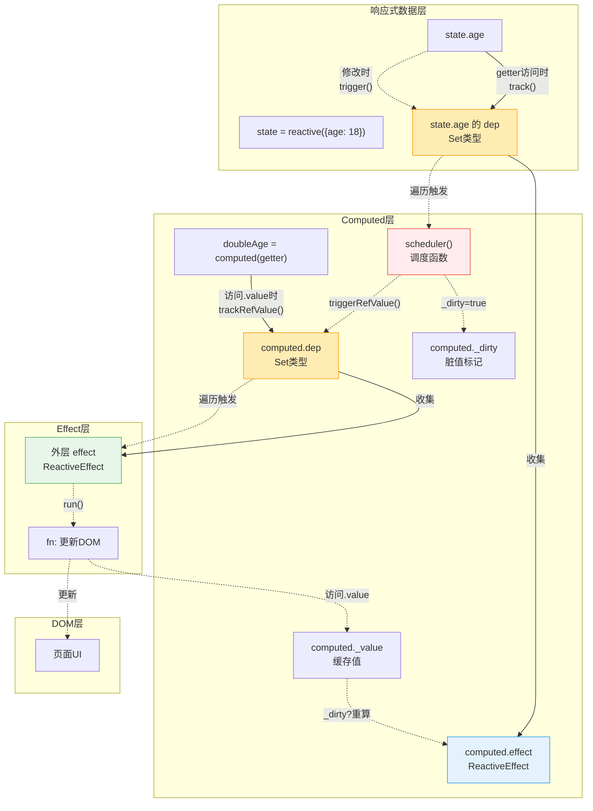

### 依赖收集 vs 触发更新

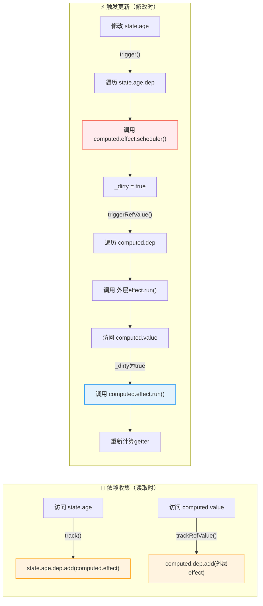

### 双向依赖关系总结

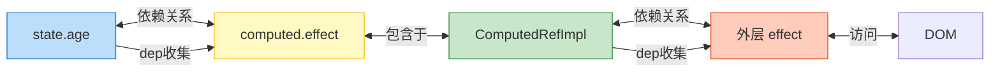

## 完整执行流程图（带函数标注）

```mermaid
flowchart TD
    Start["🚀 开始执行代码"] --> CreateReactive["reactive(state)<br/>创建响应式对象"]
    CreateReactive --> CreateComputed["computed(() => state.age * 2)<br/>创建计算属性"]

    CreateComputed --> ComputedInit["new ComputedRefImpl(getter)<br/>构造函数执行"]
    ComputedInit --> CreateEffect["new ReactiveEffect(getter, scheduler)<br/>创建 computed.effect"]
    CreateEffect --> SetScheduler["设置 scheduler<br/>() => { _dirty=true; triggerRefValue }"]
    SetScheduler --> SetDirty["初始化: _dirty=true<br/>effect.computed=this"]

    SetDirty --> CreateOuterEffect["effect(fn)<br/>创建外层 effect"]
    CreateOuterEffect --> RunOuterEffect["外层effect.run()<br/>📌activeEffect=外层effect"]
    RunOuterEffect --> SetActiveEffect1["执行外层fn()<br/>开始执行副作用函数"]
    SetActiveEffect1 --> AccessComputedValue["访问 doubleAge.value<br/>触发 getter"]

    AccessComputedValue --> ComputedGetter["get value() 执行<br/>computed.ts#28"]
    ComputedGetter --> TrackRefValue1["trackRefValue(this)<br/>ref.ts#76"]
    TrackRefValue1 --> CollectOuterEffect["trackEffects(dep)<br/>computed.dep.add(外层effect)"]

    CollectOuterEffect --> CheckDirty1{"_dirty === true?"}
    CheckDirty1 -->|true 需计算| SetDirtyFalse["this._dirty = false"]
    SetDirtyFalse --> RunComputedEffect["this.effect.run()<br/>📌activeEffect=computed.effect"]
    RunComputedEffect --> SetActiveEffect2["执行getter函数<br/>() => state.age * 2"]
    SetActiveEffect2 --> ExecuteGetter["getter内部访问state.age"]

    ExecuteGetter --> AccessStateAge["触发Proxy get trap<br/>reactive.ts"]
    AccessStateAge --> TriggerReactiveGet["baseHandler.get()"]
    TriggerReactiveGet --> TrackStateAge["track(state, 'age')<br/>effect.ts#41"]
    TrackStateAge --> CollectComputedEffect["trackEffects(dep)<br/>state.age.dep.add(computed.effect)"]

    CollectComputedEffect --> ReturnValue["getter返回 18*2=36"]
    ReturnValue --> CacheValue["this._value = 36<br/>缓存结果"]
    CacheValue --> OuterEffectContinue["外层effect.fn()继续<br/>更新DOM"]

    OuterEffectContinue --> WaitTimeout["⏱️ setTimeout 2秒"]
    WaitTimeout --> ModifyAge["state.age = 100<br/>用户修改数据"]

    ModifyAge --> TriggerReactiveSet["触发Proxy set trap<br/>reactive.ts"]
    TriggerReactiveSet --> CallTrigger["trigger(state, 'age')<br/>effect.ts#66"]
    CallTrigger --> GetDep["获取dep<br/>dep = [computed.effect]"]
    GetDep --> TriggerEffects["triggerEffects(dep)<br/>effect.ts#76"]

    TriggerEffects --> PriorityComputed["优先处理computed<br/>if(effect.computed){...}"]
    PriorityComputed --> CheckScheduler{"triggerEffect(effect)<br/>effect.scheduler存在?"}
    CheckScheduler -->|是| CallScheduler["执行scheduler()<br/>computed.ts#16-23"]

    CallScheduler --> CheckDirty2{"scheduler内部<br/>_dirty === false?"}
    CheckDirty2 -->|false需更新| SetDirtyTrue["this._dirty = true"]
    SetDirtyTrue --> TriggerRefValue["triggerRefValue(this)<br/>ref.ts#70"]
    TriggerRefValue --> TriggerComputedDep["triggerEffects(computed.dep)<br/>触发[外层effect]"]

    TriggerComputedDep --> RerunOuterEffect["外层effect.run()<br/>📌activeEffect=外层effect"]
    RerunOuterEffect --> AccessComputedValue2["外层fn()再次访问<br/>doubleAge.value"]
    AccessComputedValue2 --> ComputedGetter2["get value()执行<br/>computed.ts#28"]
    ComputedGetter2 --> TrackRefValue2["trackRefValue(this)<br/>重新收集依赖"]

    TrackRefValue2 --> CheckDirty3{"_dirty === true?<br/>需要重新计算?"}
    CheckDirty3 -->|true需计算| SetDirtyFalse2["this._dirty = false"]
    SetDirtyFalse2 --> Recalculate["this.effect.run()<br/>📌activeEffect=computed.effect"]
    Recalculate --> GetNewValue["执行getter()<br/>100 * 2 = 200"]
    GetNewValue --> CacheNewValue["this._value = 200"]
    CacheNewValue --> UpdateUI["外层effect继续<br/>更新UI显示200"]

    CheckDirty3 -->|false用缓存| ReturnCached["return this._value<br/>返回缓存值"]
    UpdateUI --> End["✅ 流程结束"]
    ReturnCached --> End

    style CreateComputed fill:#e1f5ff,stroke:#0066cc,stroke-width:2px
    style SetActiveEffect1 fill:#d4edda,stroke:#28a745,stroke-width:2px
    style SetActiveEffect2 fill:#fff3cd,stroke:#ffc107,stroke-width:2px
    style SetActiveEffect3 fill:#d4edda,stroke:#28a745,stroke-width:2px
    style SetActiveEffect4 fill:#fff3cd,stroke:#ffc107,stroke-width:2px
    style ComputedGetter fill:#fff4e1,stroke:#ff9800,stroke-width:2px
    style ComputedGetter2 fill:#fff4e1,stroke:#ff9800,stroke-width:2px
    style CallScheduler fill:#ffe1e1,stroke:#dc3545,stroke-width:2px
    style Recalculate fill:#e1ffe1,stroke:#28a745,stroke-width:2px
```

### 📌 图例说明

| 颜色        | 含义                     | 示例                             |
| ----------- | ------------------------ | -------------------------------- |
| 🟢 绿色边框 | **外层 effect 激活**     | `activeEffect = 外层 effect`     |
| 🟡 黄色边框 | **computed.effect 激活** | `activeEffect = computed.effect` |
| 🔵 蓝色背景 | **computed 初始化**      | `new ComputedRefImpl(getter)`    |
| 🟠 橙色背景 | **computed getter 执行** | `computed.value getter`          |
| 🔴 红色背景 | **调度器执行**           | `scheduler()`                    |
| 🟢 绿色背景 | **重新计算**             | `effect.run()`                   |

## 关键阶段详解

### 1️⃣ 初始化阶段

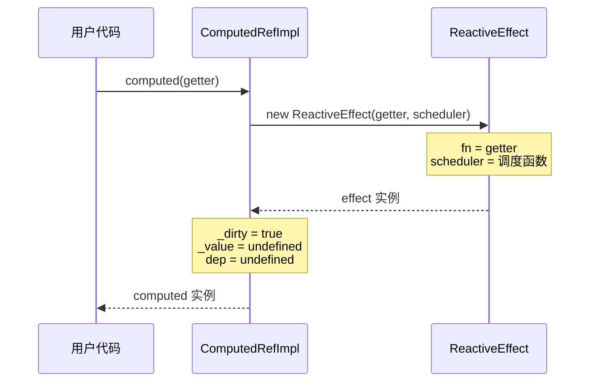

**关键代码：**

```typescript
class ComputedRefImpl<T> {
  private _value!: T;
  public dep?: Dep = undefined;
  public _dirty = true; // 标记需要计算
  public readonly effect: ReactiveEffect<T>;

  constructor(getter: any) {
    this.effect = new ReactiveEffect(getter, () => {
      // scheduler: 当依赖变化时执行
      if (!this._dirty) {
        this._dirty = true;
        triggerRefValue(this); // 通知外层 effect
      }
    });
    this.effect.computed = this; // 标记为 computed effect
  }
}
```

### 2️⃣ 首次访问阶段

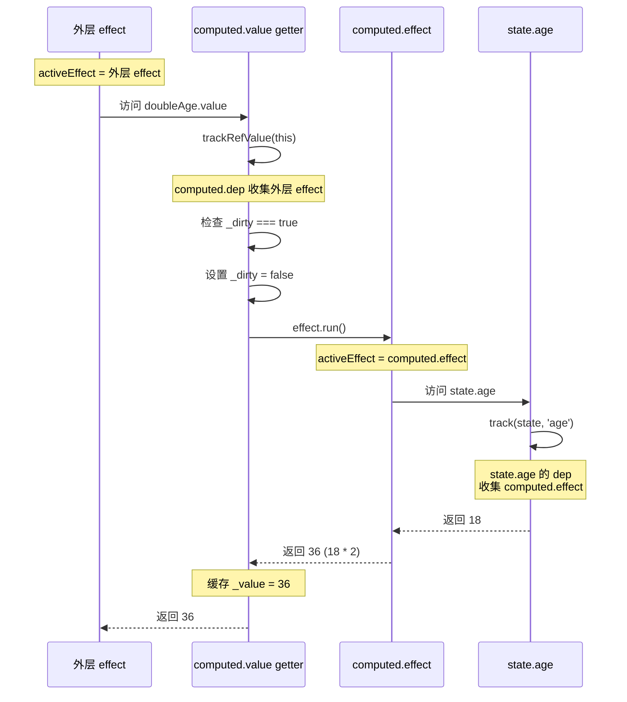

**依赖关系建立：**

```
state.age 的 dep: [computed.effect]
computed 的 dep: [外层 effect]
```

### 3️⃣ 响应式更新阶段

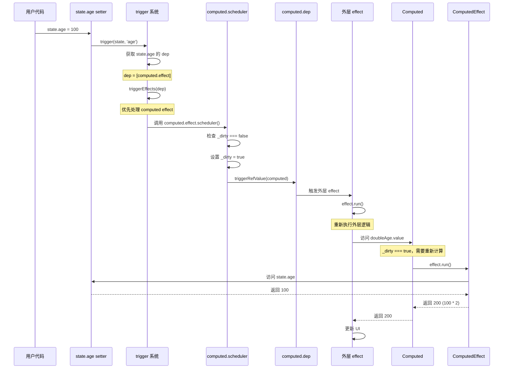

### 4️⃣ 缓存机制

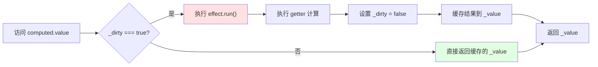

## 核心机制解析

### 🔑 双向依赖收集

1. **computed 收集外层 effect**
   - 时机：访问 `computed.value` 时
   - 位置：`trackRefValue(this)` 在 getter 开头
   - 作用：当 computed 值变化时，通知外层 effect 更新

2. **响应式数据收集 computed.effect**
   - 时机：computed 的 getter 执行时访问响应式数据
   - 位置：响应式数据的 `track()` 方法
   - 作用：当响应式数据变化时，通知 computed 重新计算

### 🔄 调度器（Scheduler）的作用

```typescript
// computed 的 scheduler
() => {
  if (!this._dirty) {
    this._dirty = true; // 标记需要重新计算
    triggerRefValue(this); // 通知依赖 computed 的 effect
  }
};
```

**为什么需要 scheduler？**

- 避免立即重新计算（懒执行）
- 只标记 `_dirty = true`，等下次访问时才计算
- 立即通知外层 effect，触发重新渲染

### ⚡ 优先级处理

在 `triggerEffects` 中，computed effect 优先执行：

```typescript
export function triggerEffects(dep: Dep) {
  // 优先触发计算属性
  dep.forEach((effect) => {
    if (effect.computed) {
      triggerEffect(effect);
    }
  });
  // 后触发非计算属性
  dep.forEach((effect) => {
    if (!effect.computed) {
      triggerEffect(effect);
    }
  });
}
```

**原因：**

- 确保 computed 先更新 `_dirty` 状态
- 外层 effect 执行时能获取最新的计算值

## 执行时序总结

| 步骤 | 操作                     | activeEffect    | \_dirty      | 依赖关系                          |
| ---- | ------------------------ | --------------- | ------------ | --------------------------------- |
| 1    | 创建 computed            | -               | true         | -                                 |
| 2    | 创建外层 effect          | -               | true         | -                                 |
| 3    | 外层 effect.run()        | 外层 effect     | true         | -                                 |
| 4    | 访问 doubleAge.value     | 外层 effect     | true         | computed.dep = [外层 effect]      |
| 5    | computed.effect.run()    | computed.effect | false        | state.age.dep = [computed.effect] |
| 6    | 修改 state.age           | -               | false        | -                                 |
| 7    | 触发 scheduler           | -               | true         | -                                 |
| 8    | 触发外层 effect          | 外层 effect     | true         | -                                 |
| 9    | 再次访问 doubleAge.value | 外层 effect     | true → false | 重新计算                          |

## 🔄 activeEffect 变化过程详解

`activeEffect` 是响应式系统中的一个核心全局变量，它指向**当前正在执行的 effect**。理解它的变化过程对于理解 computed 的双向依赖收集至关重要。

### 源码定义

```typescript
// effect.ts#9
export let activeEffect: ReactiveEffect | undefined;

// effect.ts#21-27
run() {
  activeEffect = this;  // 关键：将自己设为当前激活的 effect
  return this.fn();     // 执行副作用函数
}
```

### activeEffect 变化时间线

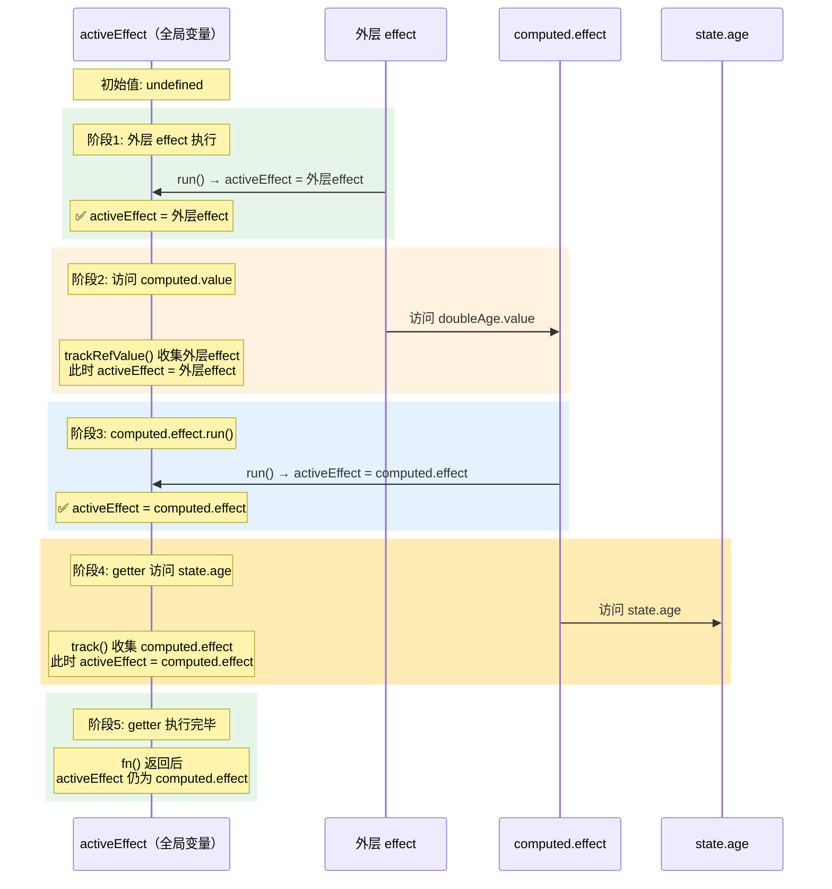

### 详细执行步骤

#### 1️⃣ 程序启动时

```javascript
// activeEffect = undefined（初始状态）
const state = reactive({ age: 18 });
const doubleAge = computed(() => state.age * 2);
// computed 创建时不执行 getter，activeEffect 保持 undefined
```

#### 2️⃣ 外层 effect 开始执行

```javascript
effect(() => {
  // 进入这里之前，effect.run() 已经执行
  // activeEffect = 外层 effect ✅

  console.log(doubleAge.value); // 访问 computed
});
```

**关键代码（effect.ts#30-33）：**

```typescript
export function effect<T = any>(fn: () => T) {
  const _effect = new ReactiveEffect(fn);
  _effect.run(); // 这里调用 run()，设置 activeEffect = _effect
}
```

#### 3️⃣ 访问 computed.value（getter 开头）

```typescript
// computed.ts#28-29
get value() {
  trackRefValue(this as any);  // 此时 activeEffect = 外层 effect
  // ↑ 收集依赖：computed.dep.add(外层 effect)
```

**依赖关系建立：**

```
computed.dep = [外层 effect]  // 因为 activeEffect 是外层 effect
```

#### 4️⃣ computed.effect.run() 执行

```typescript
// computed.ts#30-34
if (this._dirty) {
  this._dirty = false;
  this._value = this.effect.run(); // 🔄 activeEffect 切换！
  // ↑ run() 内部：activeEffect = computed.effect
}
```

**关键切换（effect.ts#21-27）：**

```typescript
run() {
  activeEffect = this;  // ← 此时 this 是 computed.effect
  return this.fn();     // 执行 getter
}
```

#### 5️⃣ getter 内部访问 state.age

```javascript
// getter: () => state.age * 2
// 访问 state.age 时，activeEffect = computed.effect
```

**依赖关系建立：**

```
state.age 的 dep = [computed.effect]  // 因为 activeEffect 是 computed.effect
```

### activeEffect 状态变化图

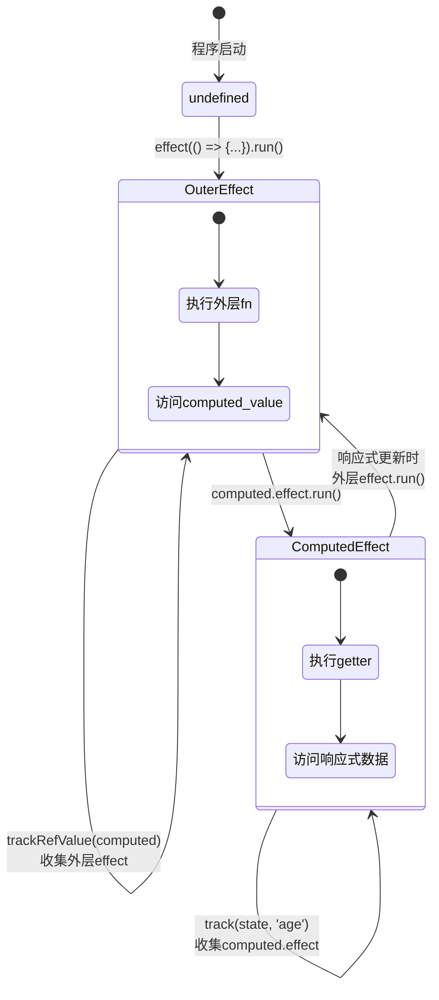

### 更新阶段的 activeEffect 变化

当 `state.age = 100` 触发更新时：

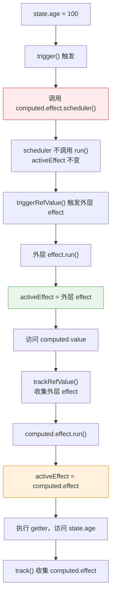

### 💡 关键理解点

| 时机                                 | activeEffect 的值  | 收集到的依赖                         |
| ------------------------------------ | ------------------ | ------------------------------------ |
| `effect(() => {...})` 的 `fn` 执行时 | 外层 effect        | -                                    |
| `trackRefValue(computed)` 时         | 外层 effect        | `computed.dep.add(外层 effect)`      |
| `computed.effect.run()` 后           | computed.effect    | -                                    |
| `track(state, 'age')` 时             | computed.effect    | `state.age.dep.add(computed.effect)` |
| `scheduler()` 执行时                 | 不变（不调用 run） | -                                    |

### ⚠️ 重要注意事项

1. **activeEffect 只在 run() 中改变**

   ```typescript
   run() {
     activeEffect = this;  // 唯一改变 activeEffect 的地方
     return this.fn();
   }
   ```

2. **scheduler() 不会改变 activeEffect**
   - scheduler 是调度器，只是标记 `_dirty = true` 并通知外层 effect
   - 它不调用 `run()`，所以不会改变 `activeEffect`

3. **依赖收集依赖于 activeEffect**

   ```typescript
   export function trackEffects(dep: Dep) {
     if (!activeEffect) {
       return; // 没有激活的 effect 则不收集
     }
     dep.add(activeEffect); // 收集当前激活的 effect
   }
   ```

4. **这就是双向依赖收集的秘密**
   - `trackRefValue(computed)` 时，`activeEffect = 外层 effect`，所以 `computed.dep` 收集到外层 effect
   - `track(state, 'age')` 时，`activeEffect = computed.effect`，所以 `state.age.dep` 收集到 computed.effect

## 常见疑问解答

### ❓ 为什么 computed 这么绕？

因为它实现了三个复杂机制：

1. **懒执行**：不访问不计算
2. **缓存**：避免重复计算
3. **双向依赖**：既依赖数据，又被 effect 依赖

### ❓ \_dirty 的作用是什么？

- `_dirty = true`：需要重新计算
- `_dirty = false`：可以使用缓存值

### ❓ 为什么需要 scheduler？

如果没有 scheduler，依赖变化时会立即重新计算，失去了懒执行的优势。有了 scheduler：

1. 依赖变化 → 只标记 `_dirty = true`
2. 通知外层 effect
3. 外层 effect 访问时才重新计算

### ❓ 为什么 scheduler 调用 triggerRefValue 不会导致死循环？

这是一个非常好的问题！看起来 scheduler → triggerRefValue → triggerEffects → ... 可能会无限循环，但 Vue 有**两个精妙的防护机制**：

#### 防护机制一：`_dirty` 标记的条件判断

```typescript
// computed.ts#16-22
this.effect = new ReactiveEffect(getter, () => {
  if (!this._dirty) {
    // 🔑 关键条件！
    this._dirty = true;
    triggerRefValue(this as any);
  }
});
```

| 步骤                   | `_dirty` 值 | `!this._dirty` | 是否进入 if |
| ---------------------- | ----------- | -------------- | ----------- |
| 初始状态               | `true`      | `false`        | ❌ 不进入   |
| 首次访问 .value 后     | `false`     | -              | -           |
| 第一次触发 scheduler   | `false`     | `true`         | ✅ 进入     |
| scheduler 内设置       | `true`      | -              | -           |
| 如果再次触发 scheduler | `true`      | `false`        | ❌ 不进入   |

**关键**：一旦 `_dirty = true` 被设置，后续的 scheduler 调用会被 `if (!this._dirty)` 阻挡。

#### 防护机制二：执行路径的本质区别

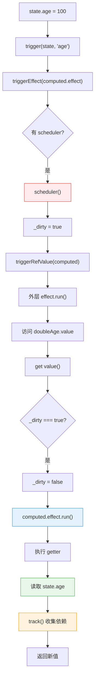

**三个关键区别：**

1. **读取不触发更新**

   ```
   getter 内部读取 state.age
       ↓
   只触发 track()（收集依赖）
       ↓
   不触发 trigger()（不更新）
   ```

2. **run() ≠ scheduler**

   ```typescript
   // triggerEffect 中（trigger 触发时）
   if (effect.scheduler) {
     effect.scheduler();  // 走 scheduler 分支
   } else {
     effect.run();
   }

   // run() 中（直接调用时）
   run() {
     activeEffect = this;
     return this.fn();  // 直接执行 fn，不走 scheduler！
   }
   ```

3. **执行路径完全不同**

   | 场景                    | 触发方式          | 执行内容                      |
   | ----------------------- | ----------------- | ----------------------------- |
   | `state.age = 100`       | `triggerEffect()` | 调用 `scheduler()`            |
   | `computed.effect.run()` | 直接调用 `run()`  | 执行 `getter`，跳过 scheduler |

#### 完整的不会死循环的证明

```
state.age = 100
    │
    ▼
trigger() → scheduler()
    │
    ├─→ _dirty = false? ✅ 首次进入
    │       │
    │       ▼
    │   _dirty = true
    │       │
    │       ▼
    │   triggerRefValue() → 外层 effect.run()
    │       │
    │       ▼
    │   访问 computed.value → get value()
    │       │
    │       ├─→ _dirty === true? ✅
    │       │       │
    │       │       ▼
    │       │   _dirty = false
    │       │       │
    │       │       ▼
    │       │   computed.effect.run() ← 直接调用，不走 scheduler！
    │       │       │
    │       │       ▼
    │       │   getter 执行，读取 state.age
    │       │       │
    │       │       ▼
    │       │   track() 收集依赖 ← 只收集，不触发！
    │       │       │
    │       │       ▼
    │       │   返回新值 200
    │       │
    │       ▼
    │   流程结束 ✅
    │
    ▼
如果再次调用 scheduler
    │
    ├─→ _dirty = true? (_dirty 现在是 false，因为刚才 get value() 设置过)
    │   等等... 让我重新分析
    │
    ▼
实际上外层 effect.run() 执行完后，_dirty = false
    │
    ▼
此时如果有新的 trigger，scheduler 会再次被调用
    │
    ├─→ _dirty = false? ✅ 可以进入
    │
    ▼
但这是一个新的更新周期，不是死循环！
```

#### 总结：为什么不会死循环

| 可能的循环点          | 为什么不会循环                               |
| --------------------- | -------------------------------------------- |
| scheduler 重复调用    | 同一更新周期内，`_dirty = true` 后条件不满足 |
| getter 读取 state.age | 读取只触发 `track()`，不触发 `trigger()`     |
| computed.effect.run() | 直接执行 `fn()`，跳过 scheduler 逻辑         |

**Vue 的精妙设计**：用 `_dirty` 标记位和执行路径的区分，优雅地避免了死循环。

### ❓ trackRefValue 为什么在 getter 开头？

确保每次访问 `computed.value` 时，都能收集当前的 `activeEffect`，建立正确的依赖关系。

## 🎯 外层 effect 与 computed.effect 执行时机对比

在 computed 的执行流程中，存在两个不同的 effect，它们的执行时机有本质区别。

### 创建时机对比流程图

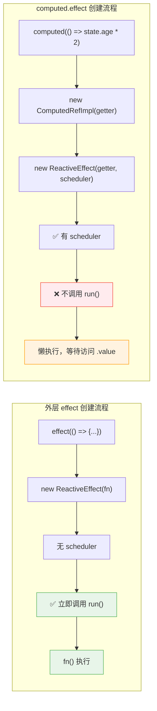

**代码对比：**

```typescript
// 外层 effect 创建
export function effect<T = any>(fn: () => T) {
  const _effect = new ReactiveEffect(fn);  // 没有 scheduler
  _effect.run();  // ✅ 立即执行 run()
}

// computed.effect 创建
constructor(getter: any) {
  this.effect = new ReactiveEffect(getter, () => {  // ✅ 有 scheduler
    if (!this._dirty) {
      this._dirty = true;
      triggerRefValue(this as any);
    }
  });
  this.effect.computed = this;
  // ❌ 不调用 run()，懒执行
}
```

### 首次执行时机对比流程图

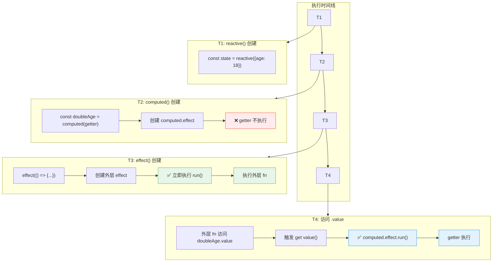

**执行顺序示例：**

```javascript
console.log('1. 开始');

const state = reactive({ age: 18 });
console.log('2. reactive 创建完成');

const doubleAge = computed(() => {
  console.log('4. computed getter 执行'); // 不是这里！
  return state.age * 2;
});
console.log('3. computed 创建完成，getter 还未执行');

effect(() => {
  console.log('5. 外层 effect 开始执行');
  const val = doubleAge.value; // 这里才触发 getter
  console.log('6. 获取到值:', val);
});

// 输出顺序：
// 1. 开始
// 2. reactive 创建完成
// 3. computed 创建完成，getter 还未执行
// 5. 外层 effect 开始执行
// 4. computed getter 执行
// 6. 获取到值: 36
```

### 依赖变化时的执行时机对比流程图

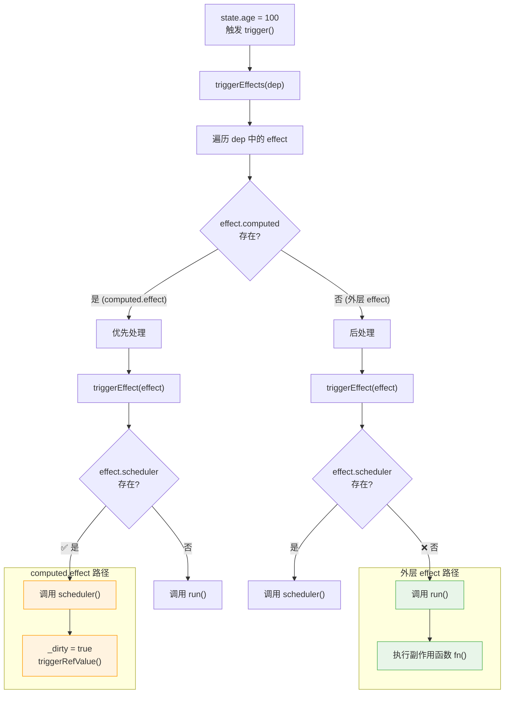

**关键区别代码：**

```typescript
// effect.ts#91-96
export function triggerEffect(effect: ReactiveEffect) {
  if (effect.scheduler) {
    effect.scheduler(); // computed.effect 走这里
  } else {
    effect.run(); // 外层 effect 走这里
  }
}
```

### 完整执行时机时序图

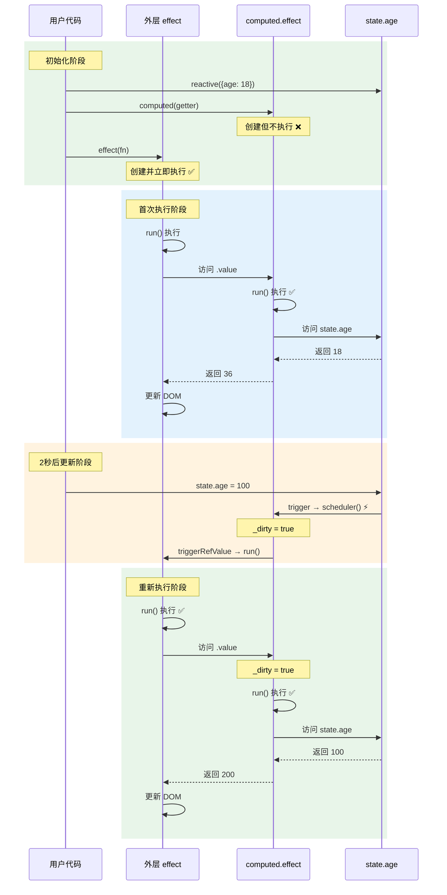

### 执行时机总结表

| 场景                                | 外层 effect         | computed.effect       |
| ----------------------------------- | ------------------- | --------------------- |
| **创建时**                          | ✅ 立即执行 `run()` | ❌ 不执行，懒加载     |
| **首次访问 `.value`**               | -                   | ✅ 执行 `run()`       |
| **依赖变化（trigger）**             | ✅ 执行 `run()`     | ⚡ 执行 `scheduler()` |
| **`.value` 被访问且 `_dirty=true`** | -                   | ✅ 执行 `run()`       |

### 两种 effect 生命周期对比图

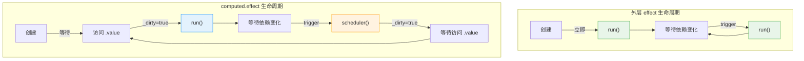

### 为什么这样设计？

```mermaid
flowchart TB
    subgraph 外层effect设计["外层 effect 设计理念"]
        O1["用户调用 effect()"]
        O2["期望副作用立即生效"]
        O3["例如：渲染 DOM、发起请求"]
        O4["✅ 创建时立即执行 run()"]
        O5["✅ 依赖变化时立即执行 run()"]
        O1 --> O2 --> O3 --> O4 --> O5
    end

    subgraph computedEffect设计["computed.effect 设计理念"]
        C1["computed 是惰性的"]
        C2["可能永远不会被使用"]
        C3["避免不必要的计算开销"]
        C4["❌ 创建时不执行"]
        C5["⚡ 依赖变化时只标记 dirty"]
        C6["✅ 访问时才真正计算"]
        C1 --> C2 --> C3 --> C4 --> C5 --> C6
    end

    style O4 fill:#e8f5e9,stroke:#4caf50
    style O5 fill:#e8f5e9,stroke:#4caf50
    style C4 fill:#ffebee,stroke:#f44336
    style C5 fill:#fff3e0,stroke:#ff9800
    style C6 fill:#e3f2fd,stroke:#2196f3
```

**设计原因总结：**

1. **外层 effect 立即执行** - 用户调用 `effect()` 期望副作用立即生效（如渲染 DOM）
2. **computed.effect 懒执行** - 避免不必要的计算，只有真正需要值时才计算
3. **computed 依赖变化时执行 scheduler** - 保持懒执行特性，只标记"脏"，下次访问时才计算
4. **外层 effect 依赖变化时直接执行 run** - 副作用需要立即响应数据变化

## 📦 trigger 时 dep 里有什么？

在 computed 场景中，存在**两个不同的 dep**，它们在不同时机被触发。

### 示例代码

```javascript
const state = reactive({ age: 18 });
const doubleAge = computed(() => state.age * 2);

effect(() => {
  document.body.innerText = doubleAge.value;
});

state.age = 100; // 触发更新
```

### 两个 dep 的内容

| dep 所属           | dep 内容            | 何时收集                   | 何时触发                              |
| ------------------ | ------------------- | -------------------------- | ------------------------------------- |
| `state.age` 的 dep | `[computed.effect]` | getter 访问 `state.age` 时 | `state.age = 100` 时                  |
| `computed` 的 dep  | `[外层 effect]`     | 外层 fn 访问 `.value` 时   | scheduler 调用 `triggerRefValue()` 时 |

### dep 是怎么来的？

#### 1. `state.age` 的 dep 收集 `computed.effect`

```javascript
// 代码执行路径
doubleAge.value              // 访问 computed
  → get value()              // computed.ts#28
    → this.effect.run()      // 执行 getter
      → activeEffect = computed.effect  // ⬅️ 关键！
        → () => state.age * 2  // getter 执行
          → 读取 state.age     // 触发 Proxy get
            → track(state, 'age')  // effect.ts#41
              → dep.add(activeEffect)  // ⬅️ 收集 computed.effect
```

**结果**：`state.age` 的 dep = `[computed.effect]`

#### 2. `computed` 的 dep 收集 `外层 effect`

```javascript
// 代码执行路径
effect(() => { ... })        // 创建外层 effect
  → _effect.run()            // effect.ts#32
    → activeEffect = 外层 effect  // ⬅️ 关键！
      → fn()                 // 执行外层 fn
        → doubleAge.value    // 访问 computed
          → get value()      // computed.ts#28
            → trackRefValue(this)  // ⬅️ 在 getter 开头！
              → dep.add(activeEffect)  // ⬅️ 收集外层 effect
```

**结果**：`computed` 的 dep = `[外层 effect]`

### trigger 时的调用链

```
state.age = 100
    │
    ▼
trigger(state, 'age')
    │
    ▼
triggerEffects(state.age的dep)  ← dep = [computed.effect]
    │
    ▼
computed.effect.scheduler()
    │
    ├── _dirty = true
    │
    ▼
triggerRefValue(computed)
    │
    ▼
triggerEffects(computed的dep)  ← dep = [外层 effect]
    │
    ▼
外层 effect.run()
```

### 一句话总结

| 时机                    | 谁在读数据              | activeEffect 是谁 | 谁被收集到 dep                         |
| ----------------------- | ----------------------- | ----------------- | -------------------------------------- |
| getter 访问 `state.age` | `computed.effect.run()` | `computed.effect` | `state.age.dep` 收集 `computed.effect` |
| 外层 fn 访问 `.value`   | `外层 effect.run()`     | `外层 effect`     | `computed.dep` 收集 `外层 effect`      |
