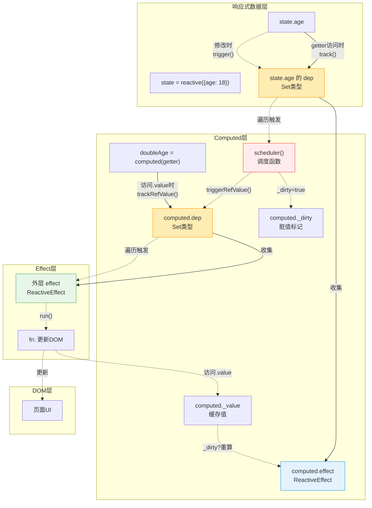
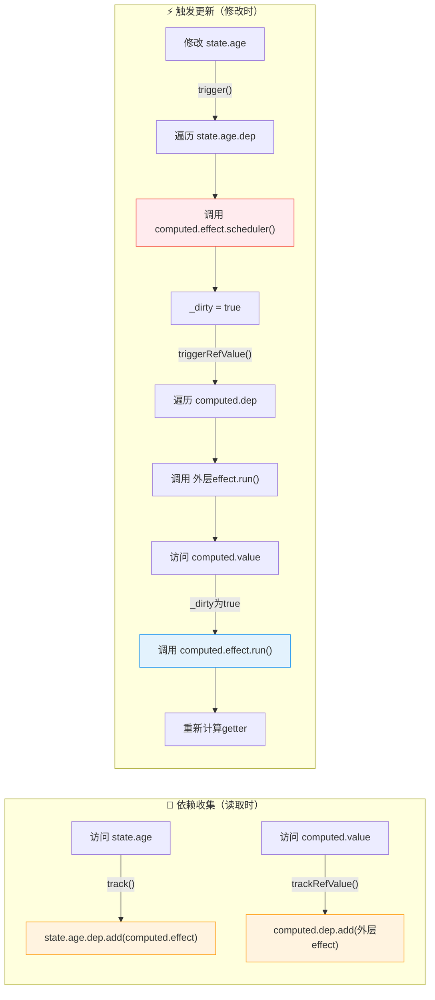
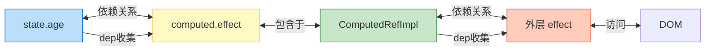
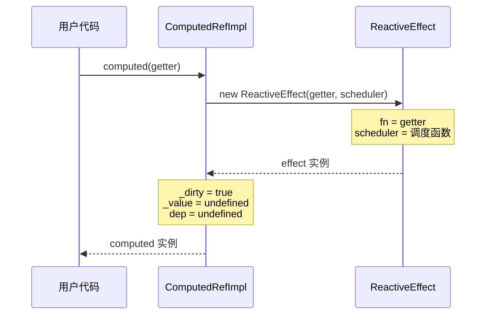
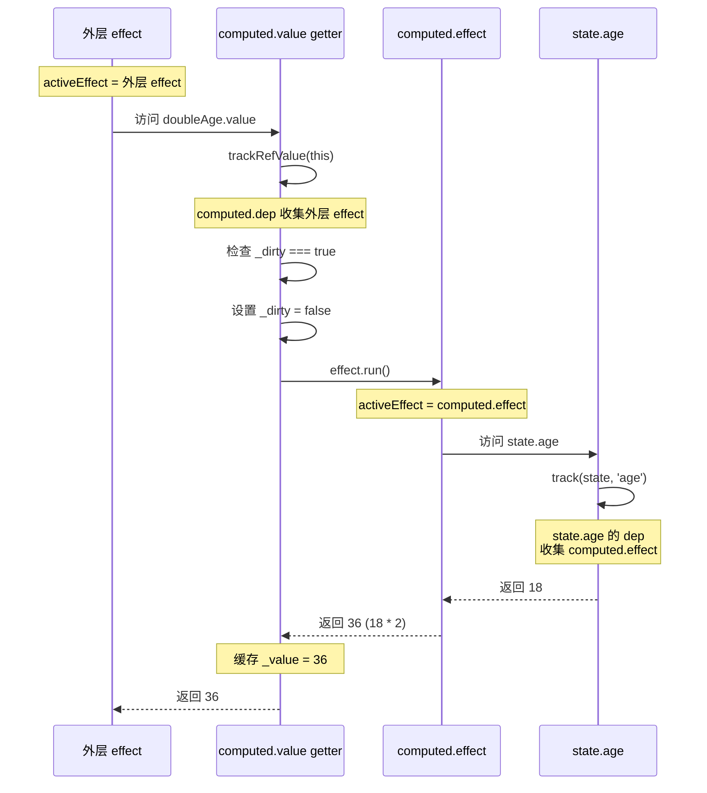
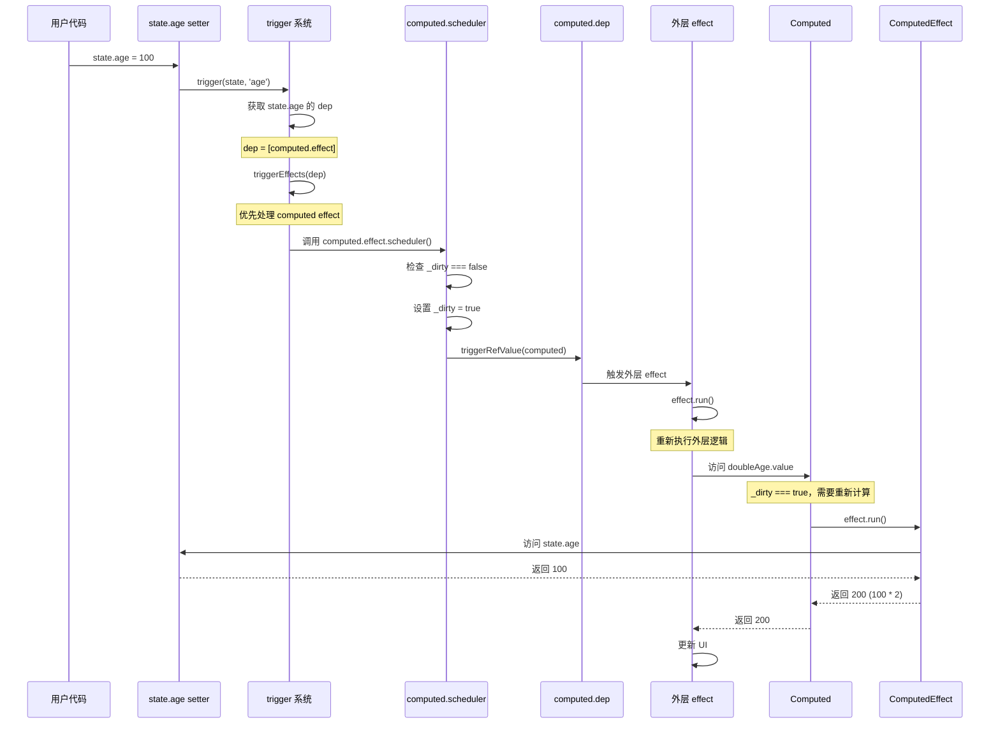
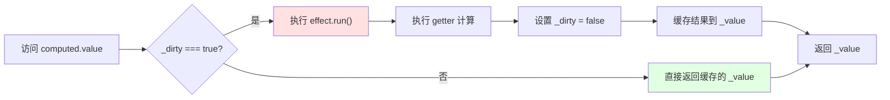

# Computed 执行流程详解

## 概述

`computed` 是 Vue 响应式系统中的计算属性实现，它具有以下特点：

- **懒执行（Lazy Evaluation）**：只有在访问 `.value` 时才会执行计算
- **缓存机制**：通过 `_dirty` 标记实现缓存，避免重复计算
- **双向依赖收集**：
  1. computed 依赖的响应式数据（如 `state.age`）会收集 `computed.effect`
  2. 使用 computed 的外层 effect 会被 `computed.dep` 收集

## 示例代码分析

```javascript
const state = reactive({
  name: 'John',
  age: 18,
});

const doubleAge = computed(() => {
  console.log('state', JSON.stringify(state));
  return state.age * 2;
});

effect(() => {
  console.log('run', state);
  document.getElementById('p1').innerText = `Age: ${doubleAge.value} - p1`;
});

setTimeout(() => {
  state.age = 100; // 触发更新
}, 2000);
```

## ⚠️ 关键概念：两个 Effect 的区别

在这个例子中存在**两个不同的 effect**，这是理解 computed 的关键：

### 1. 外层 effect（用户创建）

```javascript
// 用户手动调用 effect() 创建
effect(() => {
  document.getElementById('p1').innerText = `Age: ${doubleAge.value}`;
});
```

对应源码 `effect.ts#30-33`：

```typescript
export function effect<T = any>(fn: () => T) {
  const _effect = new ReactiveEffect(fn); // 没有 scheduler
  _effect.run(); // 立即执行
}
```

创建的对象：

```javascript
{
  fn: () => { 更新 DOM... },
  scheduler: null,        // ❌ 没有调度器
  computed: undefined     // ❌ 不是 computed
}
```

### 2. computed.effect（computed 内部创建）

```javascript
// computed 内部自动创建
const doubleAge = computed(() => state.age * 2);
```

对应源码 `computed.ts#16-25`：

```typescript
constructor(getter: any) {
  this.effect = new ReactiveEffect(getter, () => {
    // 这是 scheduler 调度器！
    if (!this._dirty) {
      this._dirty = true;
      triggerRefValue(this);
    }
  });
  this.effect.computed = this;  // 标记为 computed
}
```

创建的对象：

```javascript
{
  fn: () => state.age * 2,   // getter 函数
  scheduler: () => {...},    // ✅ 有调度器
  computed: ComputedRefImpl  // ✅ 指向 computed 实例
}
```

### 对比表格

| 特性                | 外层 effect           | computed.effect              |
| ------------------- | --------------------- | ---------------------------- |
| **创建方式**        | 用户手动 `effect(fn)` | `computed()` 内部自动        |
| **fn 函数**         | 更新 DOM              | getter `() => state.age * 2` |
| **scheduler**       | ❌ null               | ✅ 有                        |
| **effect.computed** | ❌ undefined          | ✅ 指向 ComputedRefImpl      |
| **依赖变化时**      | 直接执行 `run()`      | 执行 `scheduler()`           |

### 依赖关系图

```
┌─────────────────────────────────────────────────────────────┐
│                                                             │
│  state.age 的 dep: [computed.effect]                        │
│       │                                                     │
│       │ 当 state.age 变化                                   │
│       ▼                                                     │
│  触发 computed.effect.scheduler()                           │
│       │                                                     │
│       │ scheduler 内部调用 triggerRefValue                  │
│       ▼                                                     │
│  computed.dep: [外层 effect]                                │
│       │                                                     │
│       │ 触发外层 effect                                     │
│       ▼                                                     │
│  外层 effect.run() → 访问 doubleAge.value → 重新计算        │
│                                                             │
└─────────────────────────────────────────────────────────────┘
```

### 数据流与依赖关系图（Mermaid）



### 依赖收集 vs 触发更新



### 双向依赖关系总结



## 完整执行流程图（带函数标注）

```mermaid
flowchart TD
    Start["🚀 开始执行代码"] --> CreateReactive["reactive(state)<br/>创建响应式对象"]
    CreateReactive --> CreateComputed["computed(() => state.age * 2)<br/>创建计算属性"]

    CreateComputed --> ComputedInit["new ComputedRefImpl(getter)<br/>构造函数执行"]
    ComputedInit --> CreateEffect["new ReactiveEffect(getter, scheduler)<br/>创建 computed.effect"]
    CreateEffect --> SetScheduler["设置 scheduler<br/>() => { _dirty=true; triggerRefValue }"]
    SetScheduler --> SetDirty["初始化: _dirty=true<br/>effect.computed=this"]

    SetDirty --> CreateOuterEffect["effect(fn)<br/>创建外层 effect"]
    CreateOuterEffect --> RunOuterEffect["外层effect.run()<br/>📌activeEffect=外层effect"]
    RunOuterEffect --> SetActiveEffect1["执行外层fn()<br/>开始执行副作用函数"]
    SetActiveEffect1 --> AccessComputedValue["访问 doubleAge.value<br/>触发 getter"]

    AccessComputedValue --> ComputedGetter["get value() 执行<br/>computed.ts#28"]
    ComputedGetter --> TrackRefValue1["trackRefValue(this)<br/>ref.ts#76"]
    TrackRefValue1 --> CollectOuterEffect["trackEffects(dep)<br/>computed.dep.add(外层effect)"]

    CollectOuterEffect --> CheckDirty1{"_dirty === true?"}
    CheckDirty1 -->|true 需计算| SetDirtyFalse["this._dirty = false"]
    SetDirtyFalse --> RunComputedEffect["this.effect.run()<br/>📌activeEffect=computed.effect"]
    RunComputedEffect --> SetActiveEffect2["执行getter函数<br/>() => state.age * 2"]
    SetActiveEffect2 --> ExecuteGetter["getter内部访问state.age"]

    ExecuteGetter --> AccessStateAge["触发Proxy get trap<br/>reactive.ts"]
    AccessStateAge --> TriggerReactiveGet["baseHandler.get()"]
    TriggerReactiveGet --> TrackStateAge["track(state, 'age')<br/>effect.ts#41"]
    TrackStateAge --> CollectComputedEffect["trackEffects(dep)<br/>state.age.dep.add(computed.effect)"]

    CollectComputedEffect --> ReturnValue["getter返回 18*2=36"]
    ReturnValue --> CacheValue["this._value = 36<br/>缓存结果"]
    CacheValue --> OuterEffectContinue["外层effect.fn()继续<br/>更新DOM"]

    OuterEffectContinue --> WaitTimeout["⏱️ setTimeout 2秒"]
    WaitTimeout --> ModifyAge["state.age = 100<br/>用户修改数据"]

    ModifyAge --> TriggerReactiveSet["触发Proxy set trap<br/>reactive.ts"]
    TriggerReactiveSet --> CallTrigger["trigger(state, 'age')<br/>effect.ts#66"]
    CallTrigger --> GetDep["获取dep<br/>dep = [computed.effect]"]
    GetDep --> TriggerEffects["triggerEffects(dep)<br/>effect.ts#76"]

    TriggerEffects --> PriorityComputed["优先处理computed<br/>if(effect.computed){...}"]
    PriorityComputed --> CheckScheduler{"triggerEffect(effect)<br/>effect.scheduler存在?"}
    CheckScheduler -->|是| CallScheduler["执行scheduler()<br/>computed.ts#16-23"]

    CallScheduler --> CheckDirty2{"scheduler内部<br/>_dirty === false?"}
    CheckDirty2 -->|false需更新| SetDirtyTrue["this._dirty = true"]
    SetDirtyTrue --> TriggerRefValue["triggerRefValue(this)<br/>ref.ts#70"]
    TriggerRefValue --> TriggerComputedDep["triggerEffects(computed.dep)<br/>触发[外层effect]"]

    TriggerComputedDep --> RerunOuterEffect["外层effect.run()<br/>📌activeEffect=外层effect"]
    RerunOuterEffect --> AccessComputedValue2["外层fn()再次访问<br/>doubleAge.value"]
    AccessComputedValue2 --> ComputedGetter2["get value()执行<br/>computed.ts#28"]
    ComputedGetter2 --> TrackRefValue2["trackRefValue(this)<br/>重新收集依赖"]

    TrackRefValue2 --> CheckDirty3{"_dirty === true?<br/>需要重新计算?"}
    CheckDirty3 -->|true需计算| SetDirtyFalse2["this._dirty = false"]
    SetDirtyFalse2 --> Recalculate["this.effect.run()<br/>📌activeEffect=computed.effect"]
    Recalculate --> GetNewValue["执行getter()<br/>100 * 2 = 200"]
    GetNewValue --> CacheNewValue["this._value = 200"]
    CacheNewValue --> UpdateUI["外层effect继续<br/>更新UI显示200"]

    CheckDirty3 -->|false用缓存| ReturnCached["return this._value<br/>返回缓存值"]
    UpdateUI --> End["✅ 流程结束"]
    ReturnCached --> End

    style CreateComputed fill:#e1f5ff,stroke:#0066cc,stroke-width:2px
    style SetActiveEffect1 fill:#d4edda,stroke:#28a745,stroke-width:2px
    style SetActiveEffect2 fill:#fff3cd,stroke:#ffc107,stroke-width:2px
    style SetActiveEffect3 fill:#d4edda,stroke:#28a745,stroke-width:2px
    style SetActiveEffect4 fill:#fff3cd,stroke:#ffc107,stroke-width:2px
    style ComputedGetter fill:#fff4e1,stroke:#ff9800,stroke-width:2px
    style ComputedGetter2 fill:#fff4e1,stroke:#ff9800,stroke-width:2px
    style CallScheduler fill:#ffe1e1,stroke:#dc3545,stroke-width:2px
    style Recalculate fill:#e1ffe1,stroke:#28a745,stroke-width:2px
```



### 📌 图例说明

| 颜色        | 含义                     | 示例                             |
| ----------- | ------------------------ | -------------------------------- |
| 🟢 绿色边框 | **外层 effect 激活**     | `activeEffect = 外层 effect`     |
| 🟡 黄色边框 | **computed.effect 激活** | `activeEffect = computed.effect` |
| 🔵 蓝色背景 | **computed 初始化**      | `new ComputedRefImpl(getter)`    |
| 🟠 橙色背景 | **computed getter 执行** | `computed.value getter`          |
| 🔴 红色背景 | **调度器执行**           | `scheduler()`                    |
| 🟢 绿色背景 | **重新计算**             | `effect.run()`                   |

## 关键阶段详解

### 1️⃣ 初始化阶段



**关键代码：**

```typescript
class ComputedRefImpl<T> {
  private _value!: T;
  public dep?: Dep = undefined;
  public _dirty = true; // 标记需要计算
  public readonly effect: ReactiveEffect<T>;

  constructor(getter: any) {
    this.effect = new ReactiveEffect(getter, () => {
      // scheduler: 当依赖变化时执行
      if (!this._dirty) {
        this._dirty = true;
        triggerRefValue(this); // 通知外层 effect
      }
    });
    this.effect.computed = this; // 标记为 computed effect
  }
}
```

### 2️⃣ 首次访问阶段



**依赖关系建立：**

```
state.age 的 dep: [computed.effect]
computed 的 dep: [外层 effect]
```

### 3️⃣ 响应式更新阶段



### 4️⃣ 缓存机制



## 核心机制解析

### 🔑 双向依赖收集

1. **computed 收集外层 effect**
   - 时机：访问 `computed.value` 时
   - 位置：`trackRefValue(this)` 在 getter 开头
   - 作用：当 computed 值变化时，通知外层 effect 更新

2. **响应式数据收集 computed.effect**
   - 时机：computed 的 getter 执行时访问响应式数据
   - 位置：响应式数据的 `track()` 方法
   - 作用：当响应式数据变化时，通知 computed 重新计算

### 🔄 调度器（Scheduler）的作用

```typescript
// computed 的 scheduler
() => {
  if (!this._dirty) {
    this._dirty = true; // 标记需要重新计算
    triggerRefValue(this); // 通知依赖 computed 的 effect
  }
};
```

**为什么需要 scheduler？**

- 避免立即重新计算（懒执行）
- 只标记 `_dirty = true`，等下次访问时才计算
- 立即通知外层 effect，触发重新渲染

### ⚡ 优先级处理

在 `triggerEffects` 中，computed effect 优先执行：

```typescript
export function triggerEffects(dep: Dep) {
  // 优先触发计算属性
  dep.forEach((effect) => {
    if (effect.computed) {
      triggerEffect(effect);
    }
  });
  // 后触发非计算属性
  dep.forEach((effect) => {
    if (!effect.computed) {
      triggerEffect(effect);
    }
  });
}
```

**原因：**

- 确保 computed 先更新 `_dirty` 状态
- 外层 effect 执行时能获取最新的计算值

## 执行时序总结

| 步骤 | 操作                     | activeEffect    | \_dirty      | 依赖关系                          |
| ---- | ------------------------ | --------------- | ------------ | --------------------------------- |
| 1    | 创建 computed            | -               | true         | -                                 |
| 2    | 创建外层 effect          | -               | true         | -                                 |
| 3    | 外层 effect.run()        | 外层 effect     | true         | -                                 |
| 4    | 访问 doubleAge.value     | 外层 effect     | true         | computed.dep = [外层 effect]      |
| 5    | computed.effect.run()    | computed.effect | false        | state.age.dep = [computed.effect] |
| 6    | 修改 state.age           | -               | false        | -                                 |
| 7    | 触发 scheduler           | -               | true         | -                                 |
| 8    | 触发外层 effect          | 外层 effect     | true         | -                                 |
| 9    | 再次访问 doubleAge.value | 外层 effect     | true → false | 重新计算                          |

## 常见疑问解答

### ❓ 为什么 computed 这么绕？

因为它实现了三个复杂机制：

1. **懒执行**：不访问不计算
2. **缓存**：避免重复计算
3. **双向依赖**：既依赖数据，又被 effect 依赖

### ❓ \_dirty 的作用是什么？

- `_dirty = true`：需要重新计算
- `_dirty = false`：可以使用缓存值

### ❓ 为什么需要 scheduler？

如果没有 scheduler，依赖变化时会立即重新计算，失去了懒执行的优势。有了 scheduler：

1. 依赖变化 → 只标记 `_dirty = true`
2. 通知外层 effect
3. 外层 effect 访问时才重新计算

### ❓ trackRefValue 为什么在 getter 开头？

确保每次访问 `computed.value` 时，都能收集当前的 `activeEffect`，建立正确的依赖关系。
