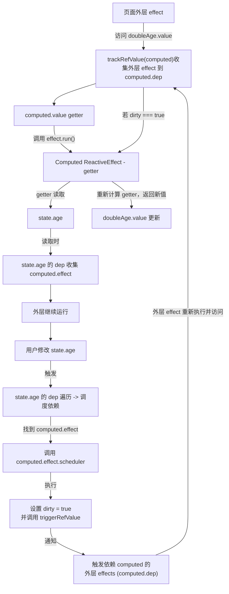

```mermaid
flowchart TD
  A["页面外层 effect"] -- "访问 doubleAge.value" --> B["trackRefValue(computed)收集外层 effect 到 computed.dep"]
  B --> C["computed.value getter"]
  C -- "调用 effect.run()" --> D["Computed ReactiveEffect - getter"]
  D -- "getter 读取" --> E["state.age"]
  E -- "读取时" --> F["state.age 的 dep 收集 computed.effect"]
  F --> G["外层继续运行"]
  G --> H["用户修改 state.age"]
  H -- "触发" --> I["state.age 的 dep 遍历 -> 调度依赖"]
  I -- "找到 computed.effect" --> J["调用 computed.effect.scheduler"]
  J -- "执行" --> K["设置 dirty = true\n并调用 triggerRefValue"]
  K -- "通知" --> L["触发依赖 computed 的\n外层 effects (computed.dep)"]
  L -- "外层 effect 重新执行并访问" --> B
  B -- "若 dirty === true" --> D
  D -- "重新计算 getter，返回新值" --> M["doubleAge.value 更新"]
```
